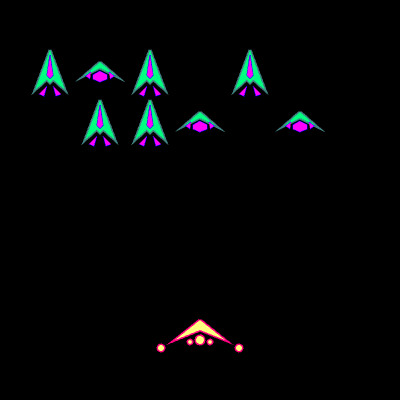

1. What genre will your game be?
a FIXED SHOOTER game, like galaga! this will mostly be based on galaga.

2. What are the objectives? Will there be a score? How do you win or lose?
the objects are to get through 3 rounds of aliens trying to shoot you. you have 3 lives, and if an alien shoots you, then you lose one of those lives. you win if you get through the 3 rounds of aliens, and you lose if you are shot and you die!

3. How will the player interact with the game?
galaga is a Fixed shooter game, meaning you can't move forward and backward, only left and right. the player will also be able to shoot the aliens to kill them.

4. What features will you include in your MVP?
at least one enemy, a player chararacter who cannot move back and forth, and projectiles that can come from both the enemy and the player. both the player and the enemy can die after one projectile hits them.

5. Make some concept art - in an HTML/JS canvas, generate a (still) image that will represents one frame of your game. (you might choose to sketch this out on paper first, but only the HTML version needs to be submitted)

